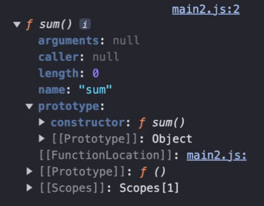
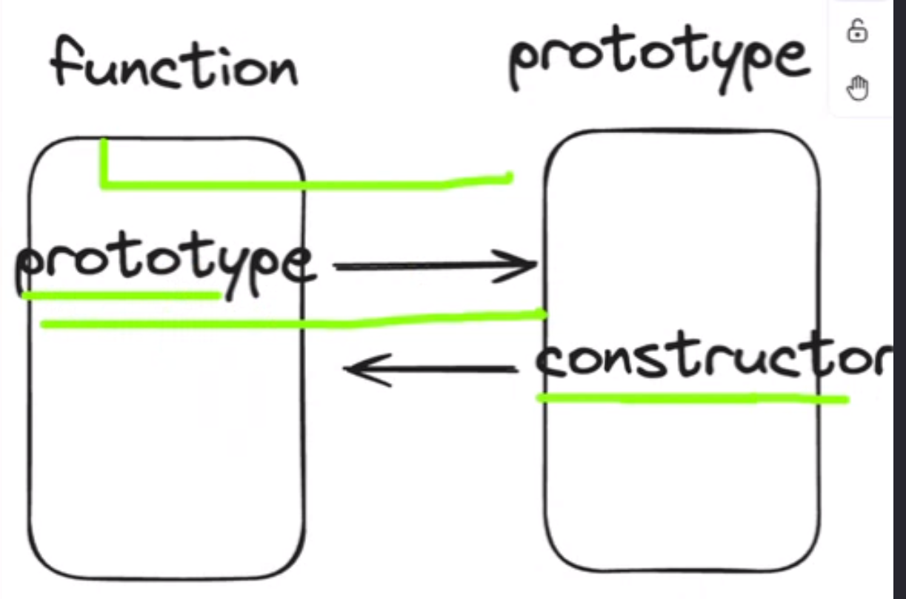
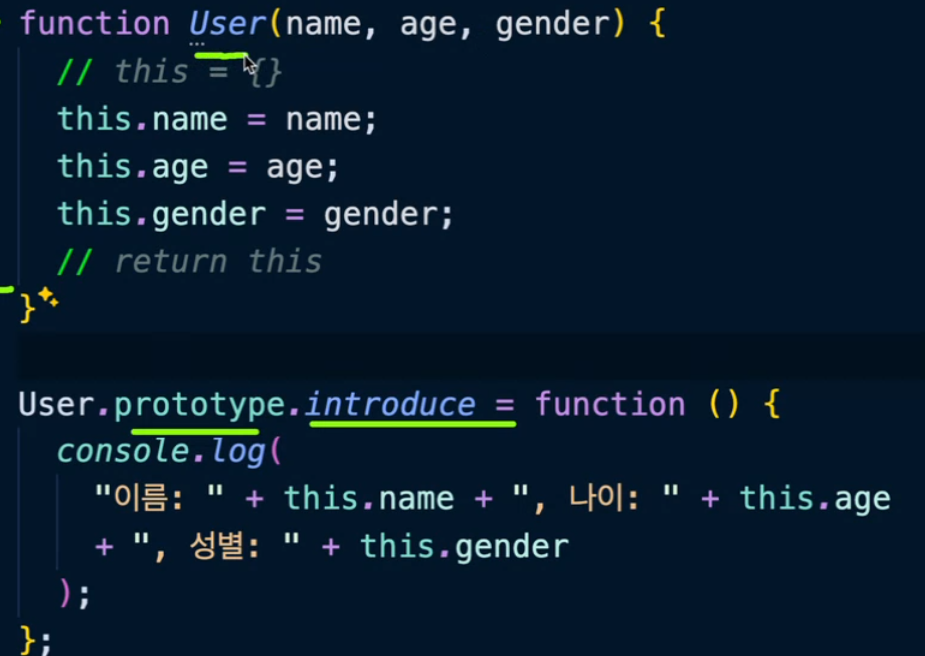

this는 자기 자신을 호출한 객체를 가리키는 특수한 키워드

console.log도 함수...윈도우

const membership() = {
name : "김기수",
joined: function(){
console.log(this);
},
};

membership.joined(); //membership이 객체

const membership() = {
name : "김기수",
joined: function(){
return `${this.name}님이 가입했습니다`;
},
};
로 사용할 수 있다.

const joined = membership.joined;
joined(); //window가 객체가 됨

전역적인 부분에서 호출되는 this는 window

this를 사용할거면 화살표 함수 사용은 않는 것이 좋다.
사용은 가능하지만 this를 로직으로 사용할거면 일반함수일때 의도한 동작대로 사용 가능

bind(): this의 값을 고정시키는 메서드

const membership() = {
name : "김기수",
joined: function(){
return `${this.name}님이 가입했습니다`;
}.bind({name: "황다경"}),
};

## 실행 컨텍스트

자바스크립트 코드가 실행될 때 필요한 환경을 제공해주는 객체

스택: FILO 자료구조
자바스크립트는 스택 구조를 도입하여 코드를 실행시킨다.
스크립트를 실행시키는 스택: 콜스택

코드를 실행하면 실행 컨텍스트 영역을 하나 생성
가장 아래에 깔리면 실행 컨텍스트를 전역 실행 컨텍스트라고 부른다.
모든 코드는 전역 실행 컨택스트 안에서 실행된다.
실행이 끝나면 콜스택에서 제거

함수가 실행이 될 때 새로운 실행 컨텍스트가 생성된다.
실행 컨택스트가 달라지면 변수명 중복 선언이 가능
1순위-같은 실행컨택스트에서 변수를 찾는다. 만약 같은 컨택스트 내에서 찾을 수 없다면
2순위-하위 실행 컨텍스트에서 변수를 찾는다. 이 역할을 하는 것이 아우터

```
const num = 10;
function printNum() {
    const num = 30;
    console.log(num);
}
printNum();
```

실행 컨텍스트 구성 요소

1. 레코드

   - 내부적으로 생성과 실행이라는 두 개의 스택으로 코드가 동작이 됨
   - 레코드 객체 생성 단계에서 코드를 기록(코드를 훓어서 변수선언, 함수선언 등을 기록)
   - var과 let/const의 생성단게 동작이 다르다.
     - var일 경우 undefined라는 값으로 초기화까지 시켜줌
     - let과 const는 초기화해주지 않음
     - 아래의 경우 var은 실행, let/const는 레퍼런스 에러
       ```
       console.log(uname);
       let uname = "수코딩";
       ```
   - 실행은 생성 단계에서 생성한 것을 참조하여 코드를 실행, 업데이트
   - 업데이트는 미완성된 기록을 업데이트 하는 것으로, 업데이트 전까지는 참조할 수 없음
   - 완성된 기록은 참조 가능하다.(var, function완성 let, const 미완성)

2. 아우터:
   - 아래의 실행컨택스트와 연결하는 연결 통로의 역할을 함
   - 전역 컨텍스트에서 아우터 객체는 아무 의미가 없다(하위의 컨텍스타가 없기 때문에)
   - 하지만 새로운 컨텍스트가 쌓이면?
   - 단방향 연결이다(위->아래). 따라서 함수 컨택스트에 변수 선언 후 전역 컨택스트에서 해당 변수를 쓰려고 하면 참조할 수 없다.

## 호이스팅

- 선언부가 최상단으로 올라가는 현상
- 선언과 할당
- var만 가능(생성 단게에서 기록되는 것들이 호이스팅의 대상)
-

## 클로저

실행 컨텍스트가 정상적으로 제거(종료)되지 못하는 현상

function outerFuc() {
let count = 0;
return function innerFunc() {
count++;
console.log(count);
}
}
const counter = outerFunc();

카운터 변수에는 innerfunc 함수가 담긴다.
counter(); //1
counter(); //2
counter(); //3

실행할 때마다 값이 1씩 증가한다.
왜 0이나 1이 아니지
-> 컨택스트가 끝나고 메모리에서 제거하려고 할 때, count를 참조하고 있기 때문에 전역 실행 컨텍스트를 제거하지 못한다.
->임시보관
호출하면 호출할수록 찌꺼기들이 쌓임->메모리 누수(낭비) 발생->퍼포먼스 떨어짐
따라서 의도적으로 클로저 코드를 사용했다면 코드 종료 이전
counter = null;
등으로 끊어줘야 한다.

## 객체 again

const obj = {}; //빈 객체 생성(아무 속성도 없는)

- 동적으로 속성을 추가할 수 있다.

obj.color = "yellow"; //color 프로퍼티 생성
console.log(obj); //{color : 'yellow'}

- 동적으로 삭제도 할 수 있다.

delete obj.color; //color 프로퍼티 삭제
console.log(obj); //{}

- 존재하지 않는 속성에 접근해도 에러를 반환하지는 않고, undefined를 출력한다.

여러가지 형태가 가능-> 확장성이 무한하다.

- 객체안에 객체, 객체 안에 배열, 객체 안에 함수, 객체 안에 객체 안에 객체도 가능
- 객체 속성갑이 함수인것을 매서드

## 생성자 함수

객체의 속성이 같고, 값이 다른 경우에, 객체를 생성할 수 있는 생성자 함수를 제공한다.

어떻게 만드냐면

function User(){ //꼭 대문자여야한다.
this.name = "John";
this.age = 30;
this.gender = "male";
}

`new` 키워드를 사용
const user1 = new User();
//User {name : 'John ....}

매개변수를 넘겨줄 수 있다.
function User(name, age, gender){ //꼭 대문자여야한다.
this.name = name;
this.age = age;
this.gender = gender;
}

속성은 같은데 서로 다른 값을 가진 객체들이 생성된다
const user1 = new User("John", 30, "male");
const user2 = new User("Jane", 28, "female");
conse user3 = new User("Alex", 22, "male");

함수를 만들어줄 수도 있다.
function User(name, age, gender){ //꼭 대문자여야한다.
this.name = name;
this.age = age;
this.gender = gender;
this.introduce = function () {
console.log(
"이름: " + this.name + ", 나이: " + this.age + ", 성별: " + this.gender
);
}
}

user1.introduce();

붕어빵 틀!! 슈크림 팥 피짜 초코

## 프로토타입

function sum(){}
console.dir(sum); 콘솔에서 확인해보면

함수만 가지는 프로토타입이라는 속성
모든 함수는 자신과 1:1로 매칭되는 프로토타입이라는 객체 공간을 가진다.

함수의 프로토타입 속성으로 접근.

컨스트럭터는 자신이 관련되어 있는 함수를 가짐
함수-> 프로토타입, 프로토타입-> 함수(컨스트럭터 참조)
상호 참조 가능




프로토타입에 introdue를 넣어두면

user1.introduce();로 정상적으로 사용할 수 있다.
생성자 함수로 생성되는 객체들은 그 생성자 함수의 프로토타입 객체를 참조할 수 있는 참조 속성을 하나씩 받는다([[Prototype]])

console.dir(user1.**proto** === User.prototype);
