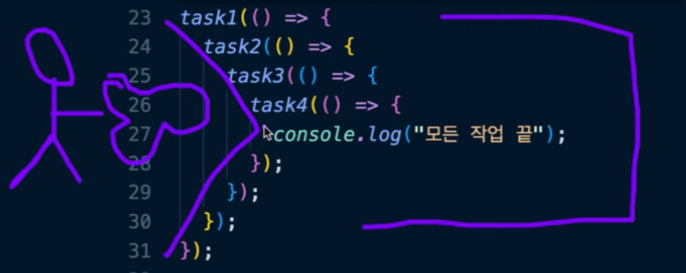
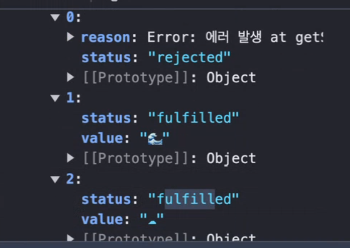

# 복습

**생성자 함수, 프로토타입**
객체를 생성하는 함수

1. 함수 선언식으로 선언 - 관례
2. 함수 식별자의 첫 글자는 대문자
   - 카멜케이스 userName - 관례
   - 스네이크케이스 user_name - 사용하지 않음
   - 파스칼 케이스 UserName - 생성자 함수 또는 클래스 이름
3. 프로토타입 체인
   - 인스턴스 내부의 `__proto__`속성으로 자신을 생성한 생성자 함수의 프로토 타입 객체를 참조하는 현상
4. 프로토타입 체이닝
   - 연결된 프로토타입 객체를 타고 올라가서 원하는 객체를 찾아내는 현상

# 클래스, 내장 객체

## 클래스

자바스크립트는 원래 클래스가 없다(!??) -> 클래스 사용을 위해 생성자 함수를 사용했었는데-> ES6에서 클래스를 도입

클래스 내부 동작은 생성자함수 프로토타입 기반이지만, 문법적 설탕을 추가한 것

- 슈가 신택스(syntantic sugar): 기존의 문법을 활용해서 편의성이나 기능을 더한 문법

### ES5 까지의 상속

```javascript
function Shape(color){
    this.color = color;
    this.getColor = function(){
        return `이 도형의 색상은 ${this.color}입니다`;
    };
}

const shape1 = new Shape("red");
console.log(shape1.color);
console.log(shape1.getColor());

function Rectangle(color, width, height){
    this.color = color;
    this.width = width;
    this.height = height;
    this.getArea = function(){
        return this.width = this.height;
    };
}

const rect1 = new Rectangle("blue", 20, 20);
const.log(rect1.getArea());

function Rectangle(color, width, height){
    Shape.call(this, color);
    this.width = width;
    this.height = height;
    this.getArea = function(){
        return this.width = this.height;
    };
}
const rect1 = new Rectangle("blue", 20, 20);
const.log(rect1.getColor()); //정상 호출

```

`super.call`을 사용하여 상위의 속성을 상속받음

### 클래스 문법

```javascript
class Shape {
  constructor(color) {
    this.color = color;
  }
  getColor() {
    return `이 도형의 색상은 ${this.color} 입니다.`;
  }
}

const shape1 = new Shape("red");
console.log(shape1);
```

클래스로 생성한 인스턴스는 클래스 내부의 매서드는 자동으로 프로토타입 객체 쪽으로 등록이 된다.

`extends`를 사용하여 클래스의 상속을 사용한다.

```javascript
class Rectangle extends Shape {
  constructor(color, width, height) {
    super(color); //상위 클래스의 color
    this.width = width;
    this.height = height;
  }
  getArea() {
    return (this.width = this.height);
  }
}

const rect1 = new Rectangle("blue", 20, 20);
console.dir(rect1);
console.log(rect1.getColor());
console.log(rect1.getArea());
```

### setter

`set`

```javascript
class Car {
  constructor(speed) {
    this.speed = speed;
  }

  set speed(speed) {
    if (speed < 0) {
      throw new Error("속도는 음수가 될 수 없습니다");
    }
  }

  getSpeed() {
    return `현재 속도는 ${this.speed}입니다.`;
  }
}

const car1 = new Car(100);
console.log(car1.getspeed());
```

`set`을 사용하여 제어하고 있기 때문에 speed가 음수 값이 되면 에러메시지가 출력된다.
음수일 경우 에러가 발생하지만 양수일 경우에는?
아무 동작도 하지 않는데, `set`을 사용했으면 앞으로의 제어는 모두 `set`이 관여하게 된다.
따라서 동작을 할 경우에 대한 제어도 `set` 내에 설정해주어야 한다.

```javascript
set speed(speed){
    if(speed < 0){
        throw new Error("속도는 음수가 될 수 없습니다.");
    }
    this.speed = speed;
}
```

-> 이 경우 무한 루프 발생(Maximum call stack)

다른 이름으로 넣어주여야 한다.

```javascript
set speed(speed){
    if(speed < 0){
        throw new Error("속도는 음수가 될 수 없습니다.");
    }
    this._speed = speed;
}

getSpeed(){
    return `현재 속도는 ${this._speed}입니다.`;
}
```

### getter

`get`

```javascript
get speed() {
    return this._speed;
}

getSpeed()
{
    return `현재 속도는 ${this.speed}입니다.`;
}
```

기존에 매서드였던 것도 속성처럼 사용할 수 있게 해준다 - 권장하지는 않음

```javascript
get getSpeed() {}

console.log(car1.getSpeed);
```

`#`을 사용하여 private한 변수 선언이 가능하다.

- 외부 요인에 의해 바뀌지 않는다
- 최초 선언한 값을 간직해

### 정적 메서드

### 인스턴스 메서드

1. 파괴적 메서드
   - 인스턴스 메서드를 호출했을 때, 원본 데이터가 변경되는 메서드
2. 비파괴적 메서드
   - 호출했을 때, 원본 데이터가 변경되지 않는 메서드

## 표준 내장 객체

자바스크립트 엔진에 기본적으로 내장되어 있는 객체

> https://developer.mozilla.org/ko/docs/Web/JavaScript/Reference/Global_Objects

### 자주 쓰이는 것

- **Object**
- Function
- **Array**
- **String**
- Boolean
- **Number**
- **Math**
- **Date**
- RegExp

`length` 속성..배열의 `length`와 문자열의 `length`는 다르다??

- 각자의 객체 내의 `length`가 각각 포함되어 잇는것

```javascript
const str = "Hello";
console.dir(str);
console.log(str.length);
```

콘솔에 찍어보면 프로토타입 등이 보이지 않는데 이게 객체나교

```javascript
const str = new String("Hello");
```

는 보이는데 말이야

자료형과 관련되어 있는 생성자 객체로 만들어야 하지만(new ~),
자바스크립트 문법적으로 단축하여 표현할 수 있는 표기법을 제공하는 것 = 리터럴 표기법

일시적으로 그 인스턴스 객체로 래핑(래퍼 객체)

## 배열 내장 객체

가장 많이 사용하게 될걸

- .push()
- .shift()
- .unshift()
- .join([separator])
- .filter() - filter((매개변수) => 조건식), true 인거만 걸러냄
- .some() - 배열 안의 어떤 요소라도 주어진 판별 함수를 적어도 하나라도 통과하는지 확인
- .every() - 배열의 모든 요소가 검사를 통과해야해
- .includes()
- .pop()
- .slice()
- .sort()

## 문자열 내장 객체

- .split()
- .charAt()
- .concat()
- .indexOf()

## Math

유틸리티 클래스<br>
수학적인 상수와 함수를 위한 속성과 메서드를 가진 내장객체로, 함수 객체가 아니다.

- max(), min()
- random()
- round()
- floor()
- ceil()
- abs()
- pow(x, y)

# 동기, 비동기

중요중요매우중요아주중요

## 동기

코드가 순차적으로 실행되는 것

- 코드의 순서가 보장이 되는 것

## 비동기

코드가 순차적으로 실행되지 않는 것

- 코드의 순서가 보장이 되지 않는 것

> 자바스크립트는 싱글 스레드 언어(하나에 한번의 처리만 가능)
> 그렇기 때문에 동기적으로 실행되는 언어이다.
> 동기적 실행 언어의 단점은 한 번에 하나의 작업만 처리할 수 있기 때문에 모든 자바스크립트 내부의 코드가 동기적으로 처리가 된다면 일부 부하가 걸리는 작업을 모두 기다려 주어야 한다 -> 비효율적 <br><br> > **싱글 스레드 언어는 비동적으로 실행되는 코드가 필요하다.**

## 콜백함수

다른 함수의 매개 변수로 전달되어 그 함수가 실행되는 동안 특정 시점에 호출되는 함수

1. 동기 콜백 함수

   - 콜백 함수가 동기적으로 실행되는 형태

   ```javascript
   function greeting(callback) {
     console.log("Hello");
     callback();
   }

   function goodby() {
     console.log("goodbye");
   }

   greeting(goodbye);
   ```

2. 비동기 콜백 함수

   - 비동기 작업이 끝난 다음에 호출되는 형태

   ```javascript
   function task1(callback) {
     setTimeout(() => {
       console.log("task1 시작");
       callback();
     }, 1000);
   }

   function task2() {
     console.log("task2 시작");
   }

   task1(task2);
   ```

### 콜백 지옥



- 코드의 가독성을 떨어트린다

## Promise

자바스크립트 비동기 작업을 처리하기 위한 객체

- pending: 비동기 처리가 아직 수행되지 않은 상태
- fulfilled: 비동기 처리가 수행된 상태
- rejected: 비동기 처리가 실패한 상태
- then, catch, finally로 결과값을 받는다.

```javascript
const promise = new Promise((resolve, reject)) =>{
    //비동기 작업을 수행하는 코드
    //작업이 성공하면 resolve(value) 호출
    //작업이 실패하면 reject(error) 호출
    console.log("doing something...");
    resolve("sucess"); //fulfulled가 되면서 값이 들어감-뭐라도 일단 넘겨줘야됨
    reject(); //안넘겨줘도 상광없음. 다만 사유를 넘기지 않는다면 에러 발생 원인을 모르겠지
});

promise
.then((value) => console.log(value)) //fulfilled 상탱서 호출
.catch((error) => console.error(error)) //reject 상태서 호출
.finally(() => console.log("finally")); //resolve, reject 상관없이 무조건 실행
```

- 콜백이 즉시 실행된다.
- then()에 reject, resolve 상태에 대해 두 개를 다 작성하면 catch()는 필요없을수돟

```javascript
const promise = new Promise((resolve, reject) => {
  const isSuccess = true;
  setTimeout(()=> {
    isSuccess ? resolve("success") : reject(new Error("fail"));
  },3000);
});

promise
.then((value) => console.log(value))
.catch((error) => console.error(error));
.finally(() => console.log("finally"));

console.log("hello");
```

**핵심!**

- resolve-fulfilled, reject-reject
- fulfilled-then, reject-catch, finally를 사용하여 처리

```javascript
const fetchNumber = new Promise((resolve, reject) => {
  setTimeout(() => {
    resolve(1);
  }, 1000);
});

fetchNumber //
  //.then((num) => console.log(num));
  .then((num) => num * 2) // 2 promise resolve(2);
  .then((num) => num * 3) // 6 promise resolve(6);
  .then((num) => num * 2) // 12 promise resolve(12);
  .then((num) => console.log(num));
```

```javascript
//promiseLike 반환
fetchNumber //
  .then((num) => {
    return new Promise((resolve, reject) => {
      resolve(num * 2);
    });
  }) //2 promise resolve(2)
  .then((num) => num * 3)
  .then((num) => num * 2)
  .then((num) => console.log(num));
```

`-` -> 받긴 받았는데 코드에서 사용하지는 않는다는 관례적 표현
`new Promise(( _ , reject) => {} )`

### 콜백 지옥을 프로미스로 바꾸자

1. 콜백을 다 지운다.

```javascript
function task1() {
  return new Promise((resolve) => {
    setTimeout(() => {
      console.log("task1 시작");
      resolve();
    }, 1000);
  });

  function task2() {
    return new Promise((resolve) => {
      console.log("task2 시작");
      resolve();
    });
  }

  function task3() {
    return new Promise((resolve) => {
      console.log("task3 시작");
      resolve();
    });
  }

  function task4() {
    return new Promise((resolve) => {
      console.log("task4 시작");
      resolve();
    });
  }
}

task1() //프로미스 내부적 반환,
  .then(() => task2())
  .then(() => task3())
  .then(() => task4())
  .then(() => console.log("모든 작업 종료"));
```

## async await

- promise에 설탕 한꼬집

```javascript
const getSunIcon = async () => "sun(아이콘임)"; //무조건 resolve
getSunIcon() //
  .then((sun) => console.log(sun));
```

```javascript
const getSunIcon() = async() => {
  await delay(1000);
  return "해(아이콘임)";
};
const getWaveIcon() = async() => {
  await delay(1000);
  return "해(아이콘임)";
};

const getCloudIcon() = async() => {
  await delay(1000);
  return "해(아이콘임)";
};

const getAllIcon = () => {
  getSunIcon().then((sun) => {
    return getWaveIceon().then((wave) =>{
      return getCloudIcon().then((cloud) => {
        console.log(`${sun} ${wave} ${cloud}`);
      });
    });
  });
};
//resolve가 실행되기를 기다렸다가...기다렸다가...기다린다
//이건 프로미스 지옥이야 이제
//await를 사용하면 탈출할 수 있을지도(회개해)
getAllIcon();
```

```javascript
const getAllIcon = async () => {
  const sun = await getSunIcon();
  const wave = await getWaveIcon();
  const cloud = await getCloudIcon();
};
```

지옥 안가도 기다려준다.

근데 한번에 와다다 쓰니 실행도 오래걸리고 조금? 조금 그래

### Promise.all

await들을 병렬 처리해버린다. <br>
실행 시간들이 획기적으로 줄어든다(거이 5초차이)

```javascript
Promise.all([getSunIcon(), getWaveIcon(), getCloudIcon()]) //
  .then((icons) => {
    console.log(icons);
    console.log(timeEnd);
  });
```

아 `then`은 쓰기 시른데요! 그럼

```javascript
const icons = await Promise.all([getSunIcon(), getWaveIcon(), getCloudIcon()]);
console.log(icons.join(", "));
```

이렇게 쓰세요

이것도 단점이 있는데, 연결된 것 중 하나만 삐끗해도 다 같이 나락가는거야.

`Promise.allSettled` -> 실패한 놈은 버리고 간다. 값은 객체 형태로 나온다.

```javascript
console.log(
  icons
    .filter((icon) => icon.status === "fulfilled")
    .map((icon) => icon.value)
    .join(",")
);
```
