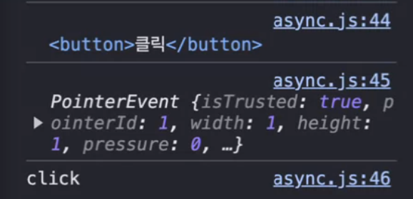

# 복습

- 자바스크립트는 싱글 스레드 기반 언어이다.
  - 한 번에 하나의 작업만 처리할 수 있다.
  - 기본적으로 동기 방식으로 작동한다.
- 언어적인 차원에서, 언어 자체가 동기적으로만 동작한다면 문제가 된다.
  - 시간이 오래 걸리는 코드도 그 시간만큼 기다렸다가 실행하니까
- 그래서 자바스크립트는 비동기 방식을 지원한다
  - 콜백
  - promise
  - async

### 과제 정답

1.

```javascript
const student = students.find((student) => student.height === 185);
console.log(student);
```

2.

```javascript
const studentList = students.filter((student) => student.age >= 20);
console.log(studentList);
```

3.

```javascript
const isStudent = students.some((student) => student.height <= 185);
console.log(isStudent);
```

4.

```javascript
const isStudentover10 = students.every((student) => student.age >= 10);
console.log(isStudentover10);
```

5.

```javascript
const averageAge = students.reduce((acc, student) => {
  acc + student.age, 0;
});
console.log(averageAge / students.length);
```

6.

```javascript
const maleStudent = students.filter((student) => student.gender === "male");
const maleAverageAge = maleStudent.reduce(
  (acc, student) => acc + student.age,
  0
);
console.log(maleAverage / maleStudent.length);
```

7.

```javascript
const femaleStudent = students.filter((student) => student.gender === "female");
```

8.

```javascript
const youngStudent = students
  .filter((student) => student.gender === "female")
  .sort((a, b) => a.age - b.age)[0];
console.log(youngStudent);
```

9.

```javascript
function reverse_to_number(number) {
  return Number(number.toString().split("").reverse().join(""));
}
```

10.

```javascript
function findLongStr(str) {
  return str.split(" ").sort((a, b) => b.length - a.length)[0];
}
```

# DOM

HTML(태그)을 객체로 표현한 것

- 문서 객체를 제어하기 위한 모델을 의미

### 천하무적

`document.querySelector()` `document.querySelectorAll()`

```javascript
const h1El = document.querySelectior("h1");
console.log(h1El);
```

문서 객체 바꾸기

```javascript
h1E1.innerHTML = "<i>sdfadf</i>";
h1El.innerText = "<i>dfafdf</i>";
```

스타일 주기

```javascript
h1El.style.color = "red";
```

클래스 추가

```javascript
h1El.classList.add("active");
console.log(h1El);
```

클래스 제거

```javascript
h1El.classList.remove("active");
```

클래스 토글

```javascript
h1El.classList.toggle("done");
```

input.value 가져오는 법

```javascript
setTimeout(() => {
  const inputEl = document.quearySelector("input");
  console.log(inputEl.value);
}, 3000);
```

### get 메서드

현대의 인터넷에서 get을 사용한 퍼포먼스적 혜택은 별로 없기 때문에 굳이 사용하지 않아도 된다. `queryselector` 사용

# 이벤트

사용자가 웹 페이지의 특정 요소와 상호 작용할 때 발생하는 것

1. 이벤트 타겟 -> 이벤트가 발생한 요소
2. 이벤트 타입 -> click, keydown, keyup, mouseover..
3. 이벤트 핸들러 -> 이벤트가 발생했을 때 실행할 코드
4. 이벤트 등록 -> 이벤트 타겟에, 이벤트 타입과 이벤트 핸들러 동작을 등록하는 것

```javascript
const inputEl = document.querySelector("input");
//inputEl.addEventListener(이벤트타입, 이벤트핸들러);
inputEl.addEventListener("keydown", () => {
  console.log("keydown");
});

//화살표 함수에서는 this가 제대로 바인딩 되지 않는다
inputEl.addEventListener("keydown", function (ev) {
  console.log(this);
  console.log(ev);
  console.log("keydown");
});
```

```javascript
const buttonEl = document.querySelector("button");
buttonEl.addEventListener("click", function (ev) {
  console.log(this);
  console.log(ev);
  console.log("click");
});

//마우스 객체는 모두 포인터를 받음
```


