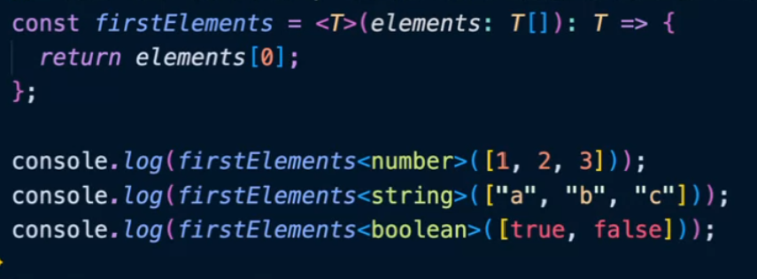

# 개발 환경 설정

```bash
npm i typescript
npx tsc -v #버전 확인

npm i ts-node
npx ts-node -v
```

settings-상단 open settings 아이콘을 클릭한 후

```json
# setting
# code-runner.excutorMap 추가
"code-runner.clearPreviousOutput": true,
"code-runner.executorMap": {
  "typescript": "node_modules/.bin/ts-node"
},
```

코드를 추가한다.

처음 json 파일을 열었을 때 clearPreviousOutput 코드가 없어서 당황했다.
Code Runner을 재설치해보기도 하였는데, 코드는 나타나지 않았고.
익스텐션 설정에 들어가보니 체크하는 항목이 있어서 체크를 했더니 코드가 추가되었다.
`code-runner.excutorMap`도 직접 추가하지 않고 익스텐션 설정에서 `Edit in settings.json`을 클릭하여 추가하였다.
<br>
뭔가 엄청 긴 코드가 나오는데, 일단 타입스크립트 코드를 추가하고 실행해보니 오류 알림이 뜬다.
코드 러너 글자 깨짐 발생
<br>
와 수강생분 중 짱짱 개발자님이 알려준대로 바꿨더니 정상 출력된다...감사해요 존경해요
`"typescript": "node -r ts-node/register"`
<br>
어렵다....
<br>
<br>
패키지 글로벌 설치는 안좋다-

# 타입 추론(Type Inference)

타입스크립트가 해당 변수의 타입을 추론하는 방법

- 변수를 선언할 때 타입을 명시하지 않아도 타입스크립트가 할당된 값을 통해 타입을 추론
- any: 모든 것을 허용할 수 있는 타입
- 일반 변수는 타입 추론이 되지만 매개변수는 타입 추론이 안되기 때문에 명시 해주여야 한다.(리턴값에 해당하는 타입은 추론이 가능하다

```typescript
//case1 함수 자체에 타입 명시
const add = (a: number, b: number): string => {
  return `${a + b}입니다`;
};
//case2 변수에 타입 명시
const add2: (a: number, b: number) => string = (a, b) => {
  return `${a + b}입니다`;
};

add(10, 20);
```

# 타입 명시

변수 선언 시 타입을 명시하는 방법

- 변수명 뒤에 콜론(:)을 붙이고 타입을 명시

```typescript
const num: number = 10;
const arr: [] = [];
const arr: number[] = [1, 2, 3]; //숫자 배열이다

//타입 명시 중 tuple
const arr: [number, number, number] = [1, 2, 3];
const arr: (number | string)[] = [1, "A", 3]; // `|` 타입 오퍼레이터, 유니언 타입 연산자

const obj: {} = {};
const obj: { name: string; age: number } = { name: "kim", age: 20 };
```

### 리터럴 타입

변수에 들어갈 값을 정확하게 지정하는 것

- string 타입이나 number 타입을 명확하게(타이트하게) 지정하는 타입( 그 값 아니면 못 들어간다)

```typescript
let num: 10 = 10;
num = 20;

let num: 10 | 20 = 10;
let str: "A" | "B" = "A";
str = "B";
let obj = {
  name: "kim",
};

const printName = (name: "kim") => {
  console.log(name);
};
printName("kim"); //
printName(obj.name); //obj 안에 kim이 있는데 오류가 난다. 왜????
```

위 함수에서 리터럴 타입은 `kim`이어야 한다. 근데 obj의 name은 string 타입이지 kim 타입이 아니다. 따라서 오류가 발생한다.

```typescript
let obj = {
  name: "kim",
} as const;
//타입이 kim으로 고정이 된다. 오류도 안난다.

let obj: { name: "kim" } = {
  name: "kim",
};
```

# 타입 오퍼레이터

타입을 조작하는 연산자

1. 유니온 타입
   - OR 연산자(|)를 사용하여 여러 타입 중 하나를 선택

```typescript
const arr: (number | string)[] = [1, "A", 3];
```

2. 인터섹션 타입
   - AND 연산자(&)를 사용하여 여러 타입을 조합

```typescript
const obj: { name: string } & { age: number } = {
  //반드시 name, age를 포함해야 함. OR을 사용할 경우 둘 중 하나만 있어도 되지만...AND를 사용했으면
  name: "kim",
  age: 20,
};
```

# 인터페이스

객체의 타입을 정의하는 방법

## 왜 필요할까?

```typescript
//너무 코드가 길어진다
const obj: { name: string; age: number; gender: string; height: number } = {
  name: "kim",
  age: 20,
  gender: "male",
  height: 180,
};

//인터페이스를 사용하면
interface User {
  name: string;
  age: number;
  gender: string;
  height: number;
}

//간단해진다. 재사용성이 좋아진다
const obj: User = {
  name: "kim",
  age: 20,
  gender: "male",
  height: 180,
};

obj.age = 50; //동적으로 객체 속성 변경가능
//못 바꾸게 하고 싶다면
interface User {
  name: string;
  readonly age: number;
  gender: string;
  height: number;
}
```

`readonly`가 붙은 속성은 외부에서 값을 바꿀 수 없다.

- 옵셔널 프로퍼티

```typescript
//user1: User은 height가 필요한데, user2:User은 height가 필요없을 때
interface User {
  name: string;
  age: number;
  gender: string;
  height: number;
}

interface User2 {
  name: string;
  age: number;
  gender: string;
}
//따로 지정해줘야한다-> 비효율적
interface User {
  name: string;
  age: number;
  gender: string;
  height?: number;
}
```

`?`를 붙이는 순간 있어도 그만 없어도 그만인 속성이 되.

- 병합
  - 똑같은 이름이 있는 인터페이스가 정의가 되면 인터페이스는 병합이 된다

```typescript
interface User {
  name: string;
  age: number;
  height: number;
}
interface User {
  gender: string;
}
```

- 상속

```typescript
interface Job {
  title: string;
}

//Job이 User의 하위 개념이라면
interface Job extends User {
  //상위 인터페이스 상속
  title = string;
}

const user1:Job = {
  name : "kim",
  age : 20,
  gender : "male",
  height : 180,
  title : "developer"
}
```

- 맨 앞에 I를 붙이면 인터페이슨지 아닌지 알 수 있다(꼭은 아니지만 관례적으로)

- 인덱스 시그니처

```typescript
interface ISignature {
  [key : string] : string | number;
}

//객체의 키에 해당하는 타입, 값에 해당하는 타입을 명시해줌
const user1 : ISignature = {
  name : "kim",
  age : 20,
  gender: male,
  height: 180,
  title : "developer
}
//키가 문자열이고 값이 문자열 또는 숫자이면 문제가 엇다ㅏ...!

//단점은 속성이 명확하지 않다는것
```

# 타입 별칭

새로운 타입을 정의하는 방법

```typescript
const phoneColor:
  | "red"
  | "orange"
  | "yellow"
  | "green"
  | "blue"
  | "indigo"
  | "violet" = "red";

//가독성이 안좋아진다
//새로운 타입을 지정하고 싶어졋다
//T로 시작
type TRainbowColor =
  | "red"
  | "orange"
  | "yellow"
  | "green"
  | "blue"
  | "indigo"
  | "violet";

const phoneColor: TRainbowColor = "indigo";

type TUseStatus = "Y" | "N";
let useYn: TUseStatus = "Y";

type TUser = {
  name: string;
};
const user1: TUser = {
  name: "kim",
};
```

- 인터페이스랑은 비슷하지만 다르다
  - 상속의 개념이 없다.
  - 그럼 어떻게 상속같은 기능을 구현을 할까? -> 인터섹션 타입을 사용
  - 병합이 안된다
  - 툴팁이 다르다

```typescript
type TUser = {
  name: string;
};
type TJob = {
  title: string;
};
type TUserAndJob = TUser & TJob;
```

- 객체를 정의할 땐 인터페이스
- 객체가 아닌 타입을 정의할 때는 타입
  - 강사님은 타입만 써(왜? 아무리 생각해봐도 더 이점이 많다)
    - 타입도 `readonly`, `옵셔널 프로퍼티`사용 가능
    - 자동 병합이 안되는건 어찌보면 장점일수도
    - 마우스를 올리면 툴팁으로 쉽게 확인 가능하다(인터페이스는 안보여준다)

# 제네릭

타입을 미리 지정하지 않고, 사용하는 시점에 타입을 정의해서 쓸 수 있는 문법


### 타입 제약

.length()처럼 특정 속성을 가진 값으로 제약하는 것

```typescript
const getLength = <T extends { length: number }>(item: T): void =>
  console.log(item);

console.log(getLength([1, 2, 3]);
console.log(getLength(["a", "b", "c"]));
console.log(ge)
```
