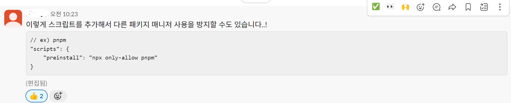

# ES6 문법

### 비구조화 할당

```javascript
const [food1, food2, food3] = ["apple", "banana", "orange"];
console.log(food1, food2, food3); //apple, banana, orange
```

객체의 비구조화 할당은 객체의 속성 이름을 그대로 따라야 한다.

```javascript
const { animalName, animalType, animalAge, animalGender} {
    animaName: "댕댕이",
    animalType: "똥개",
    animalAge: 1,
    animalGender: "수컷",
}
```

`alias(별칭)`

```javascript
const printHello = ({ name: uu, age }) => `${uu}은 ${age}세 입니다`;
console.log(printHello({ name: "철수", age: 20 }));
```

### 얕은 복사, 깊은 복사

```javascript
const arr1 = [10, 20, 30];
const arr2 = arr1; //얕복
const arr3 = [...arr1]; //arr1에 있는 각각의 요소를 퍼트리겠당 -> [10, 20, 30]
```

### Spread 연산자

1. 함수 매개 변수 -> 나머지(가변) 매개 변수
2. 비구조화 할당 -> 비구조화 할당하고 남은 데이터를 한 번에 처리할 때 사용
3. 배열
   1. 깊은 복사(deep copy)
   2. 배열 병합(concat)
4. 객체
   1. 속성의 값이 중복되면 뒤의 값이 덮어씌워진다.

# React

리액트 시작

## NPM, NPX, YARN

- NPM(Node Package Manager): Node.js의 기본 패키지 관리자
- NPX(Node Package Execute): Node 패키지를 실행하는 도구
- YARN: 페이스북에서 개발한 패키지 매니저. 더 빠르고, 더 안전하며, 더 확장적인 의존성 관리를 목표로 개발됨
  
  귀엽당
  - 지원하지 않는 패키지가 있을수도
- npm으로 시작했으면 끝까지 npm, yarn으로 시작했으면 yarn으로. 섞어쓰기는 안댐(해본거같은데...?) 앞으로 하지말자
- yarn보다 200배 빠른 번? burn bun인가 모르겠다

### 개꿀팁



### 패키지 버전

> Major.Minor.Patch - Optional pre-release label

- Major: 엄청엄청난 변화-> 호환성이 깨질수도
- Minor: 새로운 기능 추가. 호환성은 유지
- Patch: 기존 기능에 대한 버그 수정
- Optional: 특정 버전 뒤에 문자열로 된 의미를 부여하고 싶을 때

## 프로젝트 생성하기

### Create-React-App

https://create-react-app.dev/
너무너무너무 오래됏다. last release가 2022년도다 앞으로 쓰면 안된다.
어디서 배웠냐? 코딩애플 강의여

### vite

https://vitejs.dev/

?Project name:
에 .을 찍으면 새로 폴더 생성 없이 현재 위치에 프로젝트 생성

### 프로젝트 삭제하기

`rm -rf vite-react/`

### cra vs vite

컴포넌트 코드의 확장자: cra(js), vite(tsx)

### jsx: javascript xml

jsx는 자바스크립트의 확장 문법으로, javascript의 모든 기능을 포함하고 있다. html 태그를 사용할 수 있다.

### npm run dev

npm run dev가 안되는 이유
<br>
package.json을 보자
<br>
누군가 `"dev":"vite"`를 바꿔놨다. 몰루겠으면 package.json을 보고 npm run \_\_으로 쓰자
